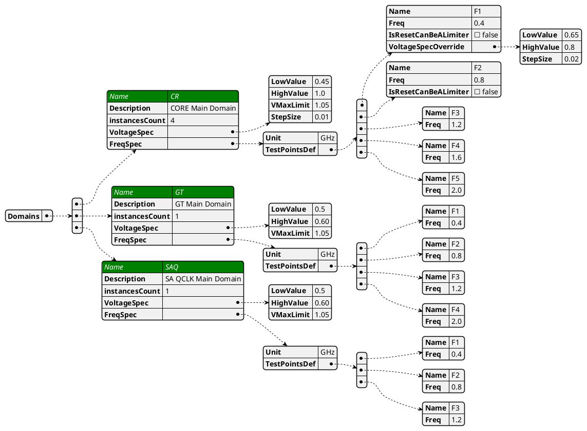
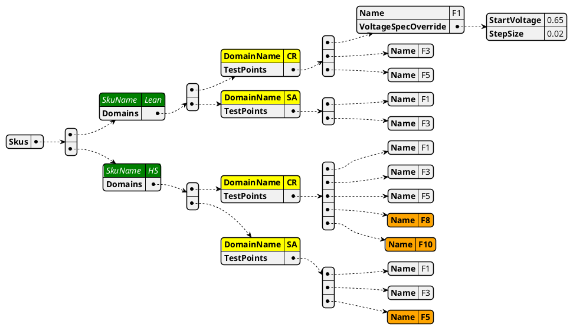

# Bin Matrix Input File

|            | Comments                                                                                          |
|------------|---------------------------------------------------------------------------------------------------|
| Definition | a product spec describing all available testing points and domains, frequencies and voltage specs |
| Scope      | Global per product                                                                                |
| Owner      | YBS Team                                                                                          |

Opens:
1. number of TestInstances is not defined in BinMatrix and need to be added
2. sometime the StartVoltage is a calculation and not a absolute number --> make sure you have a way to handle it in the flow
2. Scoreboarding to use VoltageDelta instead of Ticks
3. can we add the GB as part of the VMinForwadring File??? we need to handle a file per operatino/socket

# Sku Definition
|            | Comments                                                                       |
|------------|--------------------------------------------------------------------------------|
| Definition | a testing definition spec describing the required frequencies/flows per domain |
| Scope      | Global per product                                                             |
| Owner      | YBS Team                                                                       |
