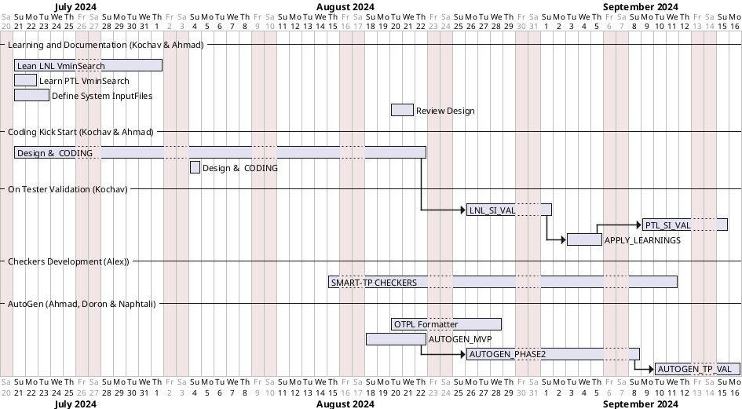

# Vmin Search Direction and Plan

## Direction
1. Create a standalone VminSearch Code and services
2. Split all Features into a small testable & reusable modules 
3. develop a bridge per PRIME Version supporting PRIME12&PRIME13
4. Replace search ranges by dynamic and smarter rangeHandler
5. Fork SCRDB and reuse dedicated PRIME template

## Refactoring Status & Plan

| # | Description                                                    | Status   |
|---|----------------------------------------------------------------|----------|
| 1 | Learn LNL VminSearch template and document all interactions    | 80% Done |
| 2 | Learn PTL gaps and document it                                 | Done     |
| 3 | Define configuration files required for VminSearch and AutoGen | 90% Done |
| 4 | Design VminSearch Director and basic services                  | Wip      |
| 5 | Review the design with Prime team & DDG team                   | Defined  |
| 6 | KickStart Code Development                                     | Defined  |
| 7 | Develop PRIME12 Bridge and Deploy in LNL Engineering Program   | Defined  |
| 8 | Deploy newly developed VminSearch in PTL-P Engineering Program | Defined  |
| 8 | Deploy newly developed VminSearch in PTL-P Engineering Program | Defined  |

## PLAN Gant

# Help Needed
1. TORCH Support for integrating AUTO-GEN natively
2. TRACE Support for new MOW & References usage
3. TORCH Support for an integrated UI handling configuration files
4. Prime Support and required new features development & Template ownership transformation
4. PTL Validation Support once tempalte is Ready