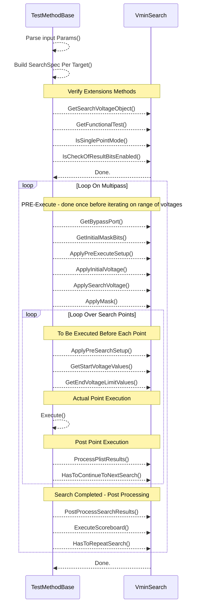
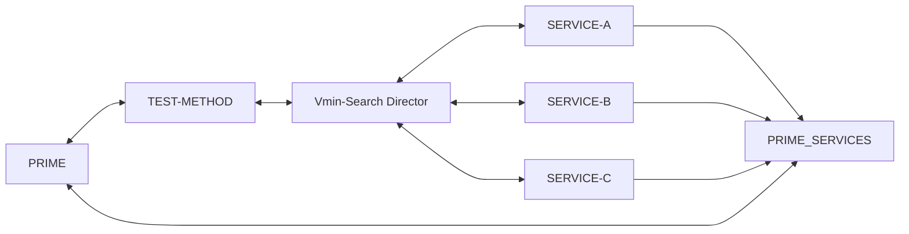
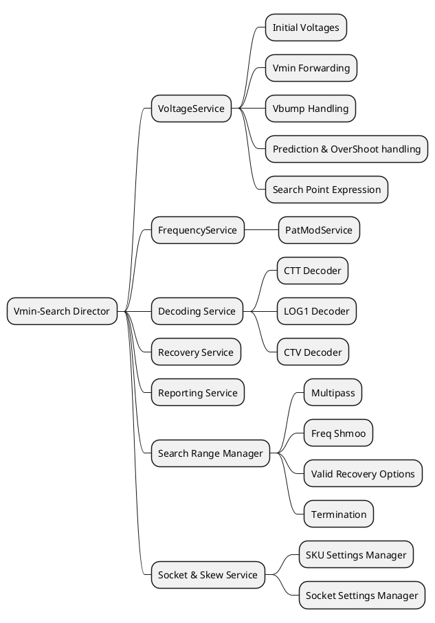

# Converged VminSearch template

## Vmin Search Current Features
| Feature                              | SupportedToday? | Recommendation | Description                                                                                           |
|--------------------------------------|-----------------|----------------|-------------------------------------------------------------------------------------------------------|
| Multipass                            | Y               | Required       | repeat same testing on different set of IPs with relevant masking                                     |
| Scoreboarding                        | Y               | Fork           | execute plist at specific voltage and collect failing patterns ids                                    |
| VBUMP        (Done)                  | N               | Required       | set the power-domain at high voltage to workaround reset failures                                     |
| Prediction & OverShoot (Done)        | Y               | Make Global    | start testing at predicted Vmin, incase of first-pass rerun vmin-search starting from overshoot value |
| Vmin Forwarding    (Done)            | Y               | Required       | store & forward the vmin located at current testing conditions                                        |
| Various Voltage Types Support (Done) | N               | Required       | handle different voltage targets types, such as DPS, DLVR or both at the samew test-instance          |
| Search Point Expression (Done)       | N               | Required       | set testing VMIN to a new value and report fwed value incase of pass                                  |
| Fail Decoders (Done)                 | N               | Required       | read/analyze execution results and report pass/fail and ticking required list                         |
| Cold/CSM Support                     | N               | Required       | support cold & csm sockets where forwarding is not allowed and more constraints are available as well |
| Vmin Export to SharedMemory          | N               | Required       | save the vmin-result to the shared memory with some GB                                                |
| integrated PATMods for Freq (Done)   | N               | Required       | handling feature enabiling/disabiling inside the test instance for dependency free testingt           |
| ITuff & Trace Logging                | N               | Required       | export & log vmin-search results to ituff for TRACE & other tools reports                             |
| Sku Special handling  (?)            | N               | Required       | different handling of vmin-search based on active sku per unit                                        |
| Recovery                             | N               | Required       | based on testing results, perform recovery on selected domains                                        |
| CTT                                  | N               | Required       | multi-domain parallel search and special start pattern & ticking handling                             |
| Termination                          | N               | Required       | terminate test-execution incase of #ticks > #threshold                                                |
| Vmin Export & Interpolation          | N               | Fork           | handle Vmin-Results export for UPS include interpolation                                              |

## Current VminSearch Calls And Loops

## High Level Arch
For a product agnostic design, we will move the VminSearch module managment into a new code "VminSearchDirector"
and develop a bridge supporting different PRIME versions

## Features consolidation into services

## New Features:
1. add a tag parameter for each test-instance to ease the bypass/unpass procedure

## Features in details:
### Multipass
The input parameter is list of bitArray (each bit represents a core) --> the order of cores defined in VoltageVminForwading
**Recommendation:** for CTT Based TP --> we will flatten the Multipass to enable bundle per pass.

### Scoreboard
scoreboard will be extracted from the regular vminSearch to simplify the regular VminSearch
what is required to run Scoreboard:
1. the SCRDB Voltage --> VminSearch Volrage - X Ticks
2. BaseNmber & MaxFail, Mode

gap: abstraction and move the configuration to a central place + baes-number allocation
Open:
* to execute the SCTDB standalone or as part of VminSearch

### VBUMP
2 params are required: Trigger Map & Levels
* sync with plist must be ensured (trigger patterns exists)
* voltage targets have 2 types DLVR/DPS, part of these targets supports only one while other support both, at first si as example, we can use DPS but afterwards to use DLVR
* YBS will instruct where VBUMP is required per domain & corer
* need a hancler per "list of targets"
* testmethod wlll have lsit of handlers
* need to have 2 type of methods to support PerTick as well as initialvoltage
* we will develop a checker as part of the pull request to validate VBUMP params & plist in sync
* each test-instance will be able to control VBUMP en/dis per group/voltage target --> by default auto-gen will set it by YBS guidlines

### Prediction & OverShoot
today AA team provides a file that contains TOKEN & FORMULA
at PRECPU, a code reads the file and save the VMIN PER targeted instances in shared memory.
TODAY: each "targeted" testinstance need to add 2 fields (Predicut=SHARED_STORAGE_PARAM_NAME & OverShot=OTHER_SHARED_STORAGE_PARAM_NAMN)
at GetStartVoltage --> set PREDICTED voltage and execute --> incase of pass --> set OVERSHOOT value and restore.

**gap**: remove the usage of params in-test-instanace and do it by code automatically, get instance name and check shared storage... incase of feature enabled set the precited and overshoot parameters...

### Vmin Forwarding
when vmin fw is required?
* By default Start&End Voltage defined at test-instance will be rendered ConvertVoltageToDoubles

Search --> get FW and use it if avaialbe
SearchnoFw --> will start from Low-->High as defiend in test instnce
SearchAndKill --> use FW value, find Vmin --> incase VminSearch Value is greater than LimitCheck (Global Def at VminForwarding) --< mainly used at COLD & CSM sockets
SinglePoint --> used at PHM where checking PList at LIMIT_CHECK Point

LimitCheck values are defined at PRECPU by DIG_BASE and it's based on CLASSHOT/COLD and it's per unit nad basd on DFF
HOT --> CSM/COLD --> PHM HOT --> PHM COLD
Search --> SearchAndKill --> SinglePoint

LNLVMinSearchINIT sets the testing modes for the VminSearch, is it recovert? LimitCheck? ... it's a dynamic and will be controled by product
need to:
1. extract the information to a config file

### Vmin Export to SharedMemory
to limit the dependecy to the test-blen internals --> the Shared Memory feature will be supported but with
a context --> the store and the restore will be forced to be inthe same TEST-BLEND!!!

### ITuff & Trace Logging
* need tp review the code and suggest a new way to perform the ituff writing
* open: what is really required? why CTT is different? and how to support that

### per sku handling
1. step size
2. start voltage
3. corner skip
4. scrdbb ticks TH
5. freq switch adjustment --> ???

### Frequency settings
by default the sttings will be extracted from the domain and flow nad using VminFw service and need to make usre that there is an option to set it
this will simplify
setPreInstance & setPostInstance --> need to clear the methodology here that each test-instnce clean,

frequency dependecy exist nad different between different test-types, therfore, we can define a dependency rule & formula per
tag and apply it automatically, still, users can set any freq they want for debug

### Vmin Export & Intrpolation
need to enforce that SEARches will use a different corner for observability and export capablite

#### Enhancement
PRIME: use a more abstract way for cores names and not by bit position

## System interesting strenths
1. the ability to order the test-blends based on si data and for free with risk free.

# Open:
* subroutine refresh checkers
* patmod on 2 domains
* how to skip flows/composites per mode
* will create a frequency settings and dependency at module level (KISS)
* restore DLVR feature
* TP Creatures Naming Convention Engine
* On-Boarding & Configuration files manager
* How Freedy implemented DTS ? Ahmad to check
* Apply Mask is TestMethod -->> CVminSearch: ApplyMask()
* Change Recovery to Yield Recovery
* SwitchAdjustemnt:
  * unit failed flow1->flow2 --> a calculation for startV (DF/DV) (StartVoltage need to be lower since hte Freq)
  * need to "lower" the Flow at previous corners as well and
  * today there is a limit that we cannot referecnce

# YBS
1. supply VBUMP info
2. supply prediction Test2Spec
3. supply start voltage & end volrage
4. PerSku

# Checkers for SMART-TP
1. VBUMP Checker to validate the VBUMP is well defined at instance & plist (ALEX)
2. PATMOD SetPoints conventions checker --> to validate all endpoints follow the future agreed convention -- AR Kochav

# Prime Tickets
1. StepSize Control
2. VminForwarding spec per sku
