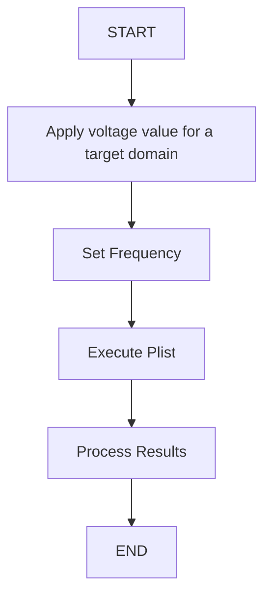
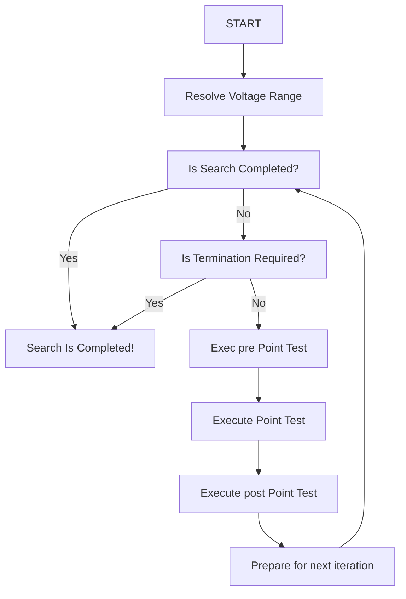
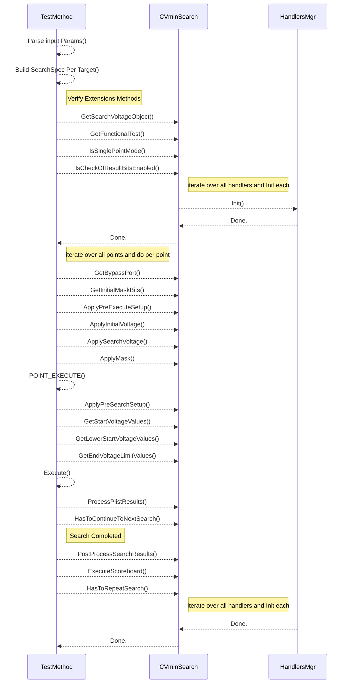

# ConvergedVminSearch

# Search Flow in High Level

# Single Point Test
We will start and define the simplest Single Point Test, setting Voltage & Frequency and execute PLIST.


# Vmin Search


# VminSearch Test Template Methods


## Supported Features
1. MultiPass
   2. GetInitalMaskBuits, ApplyPreExecuteSetup, ApplyPreSearchSetup, Ituff
2. Scoreboard
   3. executed incase SearchMode SearchWithScreb and done at the end
3. Recovery
   4. per Freq & Domain its enabled/disabled  
4. Prediction & OverShoot
   5. Enavled by PredictVmin=SHARED_STORAge, starting at Prediction, if pass set Start&Overshoot and perform vmin Search
5. Vmin Forwading
   6. should be controlled, done by Corner (e.g. ArrayGtRender@F1)
6. Various Voltage Source Types
   7. DPS/DLVR or Both
7. ResultName Saving
   8. export VMIN + GB to shared storage
8. Vbump
   9. set Trigger & Map 
9. Termination
   10. incase of more than X ticks - abort execution 
10. CTT
    11. several voltage domains and special algorithms
11. Search Point Expression
    12. CHK = SRH + INC_GB (selective and not applied for all domains and for specefic skews only)
12. Varioius PostProcessing Results (LOG1, Pin, CTV?)
    13. Log1 Deconing & per Pin analysis based on FailData Object from PRIME
13. PatModLoop/PrePAtMod/PostPatmod?
    14. TBD
14. ITuff & Trace Logging
    15. 
15. Skew Support (StepSize, Threshold?, )
16. PreSetInstace/PostSetInstance 
    17. IFPM integrated to perform PATMODs for sub/reset
18. how the implemeation will be different per socket cold/hot
19. 

```mermaid
graph 
    PRE_USER_DEFINED["PRE TES   T"]-->SRH["SRH OR PREDICT"] -->VminSearch
    VminSearch -- Failed --> RECOVERY
    VminSearch -- Pass --> SCRDB_ENABLED
    SCRDB_ENABLED -- Yes --> SCRDB
    SCRDB_ENABLED -- No --> POSTMOD
    SCRDB --> POSTMOD
    POSTMOD --> POST_USER_DEFINED
    RECOVERY --> SCRDB_ENABLED


    patmod for several instances
    speical flows - LTTC, DREC, LMAX\EMAX
    more than 1 vmin search per content type
    corner order dependency
    PH2  reset - user defined 
```

Opens:
* why we cannot do loop in TP (from Recovery back to VminSearch)
* Trace to show the actual parameter value defined in runtime (BypassPort/StartVoltage/...)
* How To Support Frequency Change for debug work
* How to add Pre/Post that is user defined
* add the Search to the InstanceComposite and add "weight" that it can be ordered by Limters --> for CTT, SRH will remain, and Vmin for CTT will be correct.
* for intrapolation --> we will use a dedicated SRH Corner that will be forwaded to CHK and will give us the ability to lean and intapolate based on search Vmin Values
* Need to Define Actual-->Virtual corners mapping
* Multi-input flowitem??