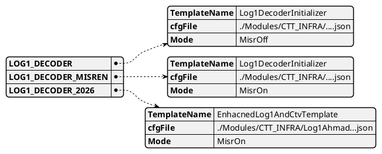

# Decoders Config

|            | Comments                                                                                                  |
|------------|-----------------------------------------------------------------------------------------------------------|
| Definition | a json to define which parameters and configuration files are required to initialize the Decoder skeleton |
| Scope      | Global Per Product                                                                                        |
| Owner      | TBD                                                                                                       |

