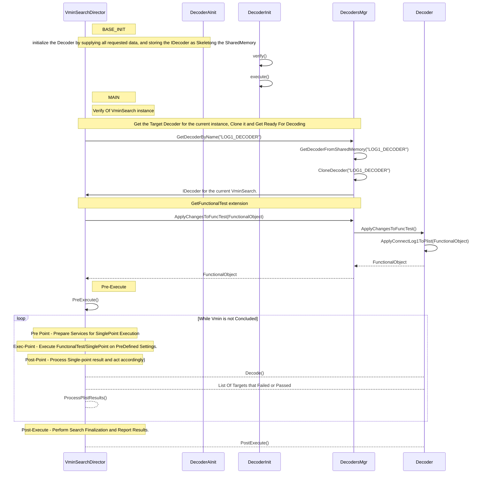

#   DirectorToDecodersMgr

# Available Decoders Today

| DecoderName | Description                                                                                  |
|-------------|----------------------------------------------------------------------------------------------|
| LOG1        | Read Tos LOG1 register per tick and determine which IP is defective                          |
| DEFAULT     | No need further decoding, voltage-target can be directly defined by the failling pattern/Pin |
| CTV         | Read Capture Memory, decode bits-string and determine pass/failing targets                   |
| CTT         | Recognize the failing Pattern, map the required Decoder, initialize it and execute it        |

# Decoders Architecture


# how hte Decoder is being selected?
1. InstanceParameter
   2. FailDecoderName = "LOG1_DECODER"
   3. FailDecoderArgs = "11110000"


```C#
interface IDecoderInit {
   IDecoder CreateDecoder(Context ctx)
}

interface IDecoder {
   BitArray Decode()
   IDecoder Clone()
   IDecoder setContext(VminSearch current,Context ctx)
   void ApplyPreExecute(string plistName)
   void ApplyPostExecute(string plistName)
}

class DecoderInit : IDecoderInit {
   IDecoder CreateDecoder(Context ctx) {
      var map = new Dictionary<string,stromg>() {
              "cfgFile" : "./Modules/CTT_INFRA/....json",
           "Mode" : "MisrOff",
      }
      IDecoderInit init = new Log1DecoderInit(map)
      IDecoder decoder = init.CreateDecoder()
      Services.SharedMemory.AddRow<IDecoder>(decoder,Polci)
      return decoder;
   }
}
   
```


