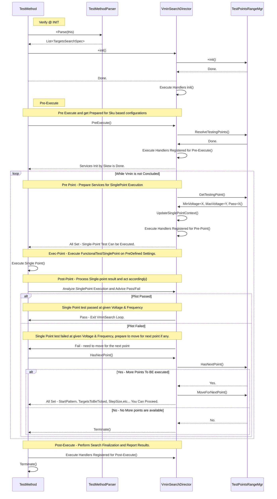
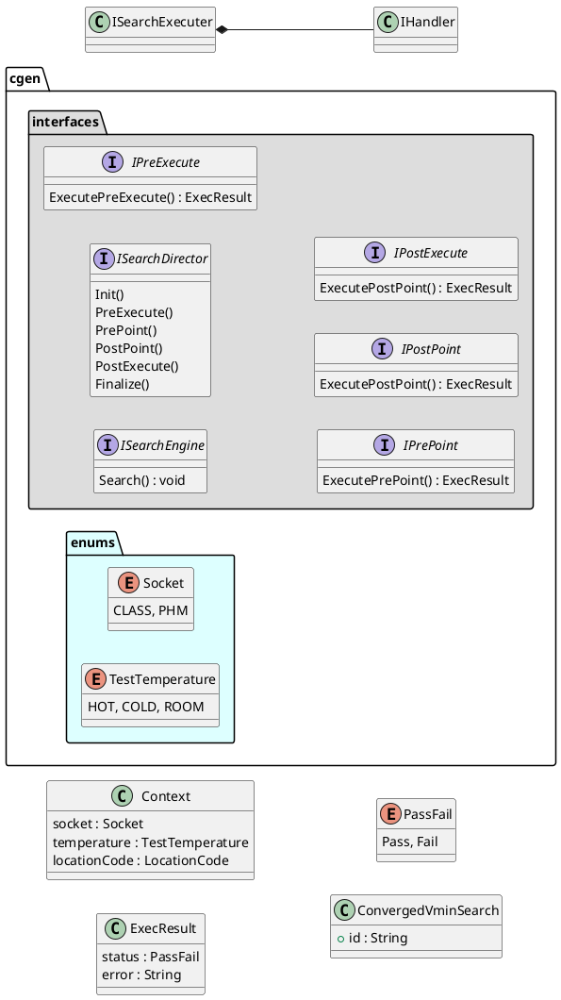
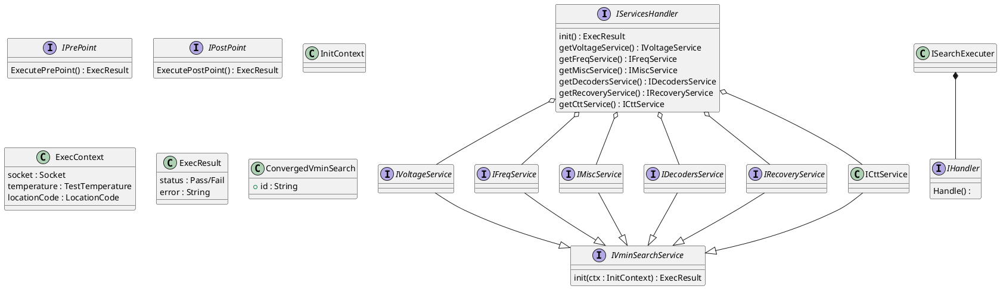

# Design

# Modules
1. Voltage Module
2. Frequencuy Module
3. SCRBD?
4. Func BASE
5. PATMOD Module
6. CTT Module
7. Misc Module
8. DTS Module
9. Recovery Module

# VminSearch Test Template Methods

