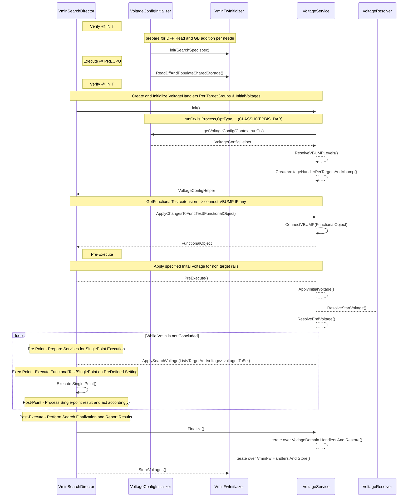

# DirectorToVoltageService

## VoltageHandler
**DpsVoltageHandler**: Apply Voltage X on DPS Rail
**DlvrVoltageHandler**: Apply ListOfVoltages on Group Of DLVR Rails 

### VoltageResolver
    ResolveStartVoltage(double instanceParameter, Context ctx)
    ResolveEndVoltage(double instnaceParam, Context ctx, double StartVoltge)

Input: 
    SearchInitSpec()
    IsGraceFullChk
case StartVoltage:
Order:
    Prime Method GetStartVoltage executes in the background
        Instance parameter - given by Prime 
            DFF Read -- given by Prime Or SharedStorage Or Literal 
    GetFromSharedMemory the Vmin Predict by InstanceName(*)
    return GetVminFwValueForCorner(,Max(a,b))
OutPut;
    Start Voltage To BE Used

case endVoltage:
Input:
    StartVoltage
Order:
Prime Method GetStartVoltage executes in the background
    Instance parameter - given by Prime
        DFF Read -- given by Prime Or SharedStorage Or Literal
    
OutPut;
Start Voltage To BE Used

# VminFwManager
 # Inputs
    CornerNAme
    SearchSpec
Body:
    Apply Flages Per SearchSpec
    Call CreateHandler and GetSourceVoltages
OutPut:
    StartVoltage 

Opens:
* if the instance name is not unique -- is it breakign anything at Precdict & overshoot?
* PRIME: can we get a file of Voltage.VoltageDomain mapping RAIL-->PATMOD per instnace? or initialize few at init and use it by demand per instnace type (e.g. CORE0 will use configA but CORE0_VBUMP will use configB)4
* PRIME: today setting a voltage using DLVR API requires the DomainName and the "PowerSupplyPinName", a better idea will be that the PowerSuppluPinNmae to be defined as part of the ALEPH file instead of storing it in test-method 
* PRIME: Restore DLVR Voltage After VBUMP as well as At Post-Execute (Restore) 
* how we can reuse the vminConfigurationForwading to Read and populate DFF to SharedMemory (without Remapping)

