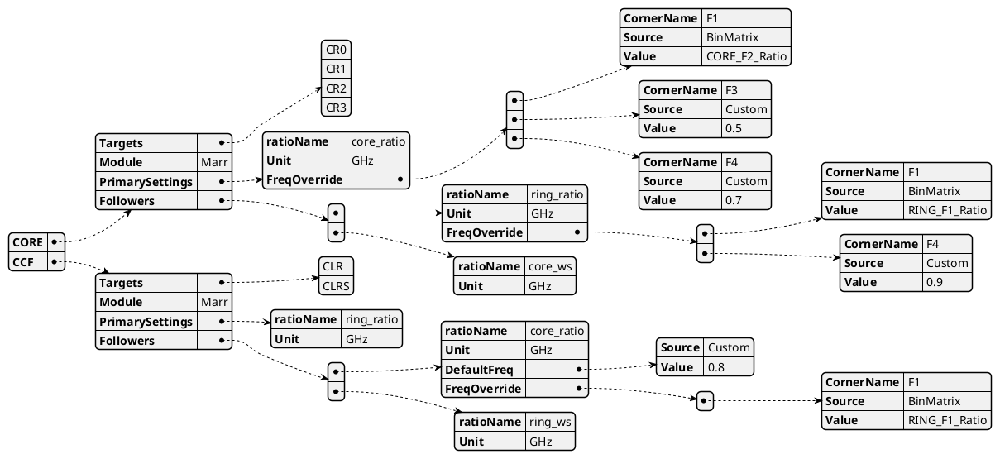

# Frequency Set Spec

MODULE::RATIONAME::VALUE(GHz/MHz)

|            | Comments                                                                  |
|------------|---------------------------------------------------------------------------|
| Definition | a json to define voltage targets, frequency mapping to YBS spec and more. |
| Scope      | Per Module                                                                |
| Owner      | Module Owner                                                              |

# Opens
NOte: RING will get 500Mhz at F3 following the Primary Overriden Freq