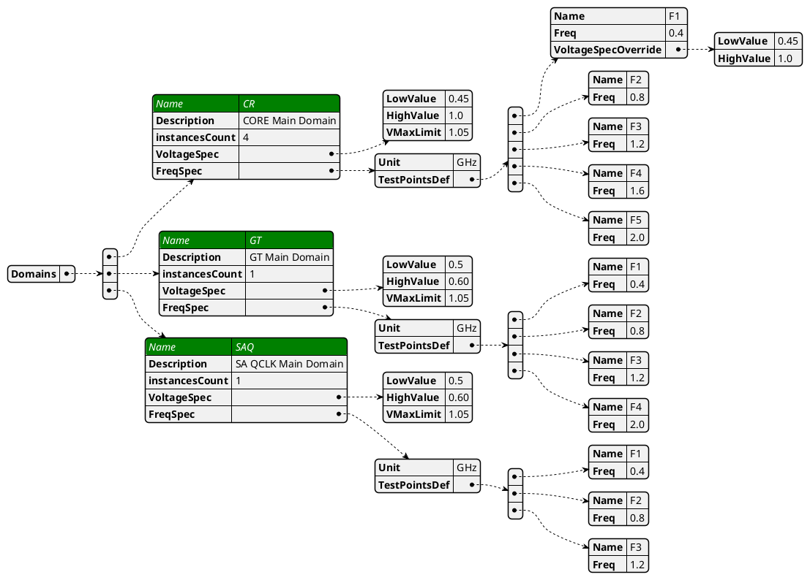
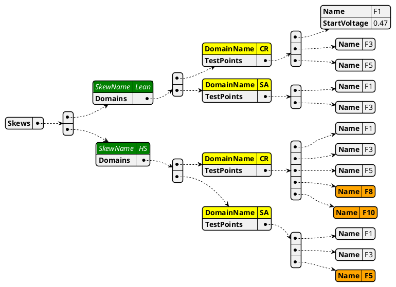
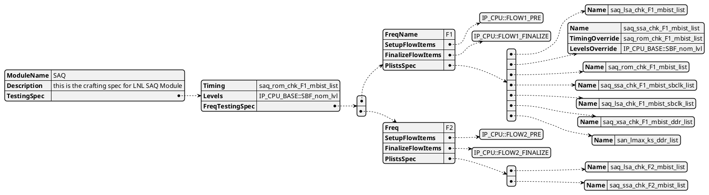

# Jsons

# Bin Matrix Input File

|            | Comments                                                                                          |
|------------|---------------------------------------------------------------------------------------------------|
| Definition | a product spec describing all available testing points and domains, frequencies and voltage specs |
| Scope      | Global per product                                                                                |
| Owner      | YBS Team                                                                                          |

# Sku Definition

|            | Comments                                                                       |
|------------|--------------------------------------------------------------------------------|
| Definition | a testing definition spec describing the required frequencies/flows per domain |
| Scope      | Global per product                                                             |
| Owner      | YBS Team                                                                       |

# Generation Spec

|            | Comments                                                           |
|------------|--------------------------------------------------------------------|
| Definition | a crafting spec describing and mapping plists to frequency corner. |
| Scope      | per Module/SubModule                                               |
| Owner      | Module Owner                                                       |

