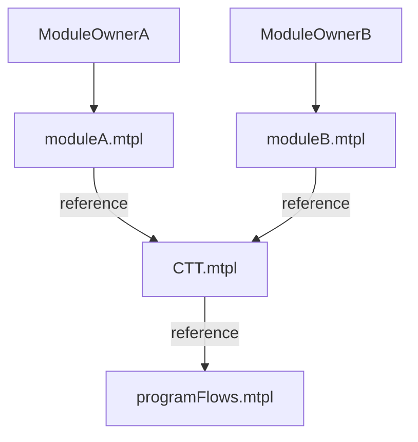

# Module Gen Arch

# The Expierement that we have done
* Modules are regular hand-crafted mtpls
* CTT as final referencing test-instances from these modules and wrap them by a FlowItem
* ProgramFlows uses references as well to link CTT Flows.


# Proposal

to enable auto-gen and create a good TP development techniques i would like to seperate auto-generated 
modules/subModules from manual crafted ones.
* ModuleOwner to create a manual test-instances/flows as needed
* ModuleOwner to create a crafting spec for auto-gen
* ModuleOwner to create a manual mtpl referencing flowitems from both mtpls
* CTT Module To reference composities/flows defined at main module.mtpl file 

**therefore,** we may need an _additional_ level of referencing as below:

## illustration of new proposal


```mermaid
graph
    ModuleOwnerA --> ManualMTPLFileA["moduleA_manual.mtpl"]
    ModuleOwnerA --> ModuleCraftSpecA1 --> AutoGen1["moduleA_autogen.mtpl"]
    AutoGen1 -- "Reference" --> Module1["moduleA.mtpl"]
    ManualMTPLFileA -- "Reference" --> Module1["moduleA.mtpl (final)"]

    ModuleOwnerB --> ManualMTPLFileB["moduleB_manual.mtpl"]
    ModuleOwnerB --> ModuleCraftSpecB--> AutoGen2["moduleB_autogen.mtpl"]
    AutoGen2 -- "Reference" --> Module2["moduleB.mtpl"]
    ManualMTPLFileB -- "Reference" --> Module2["moduleB.mtpl (final)"]
    
    Module1 -- "Reference" --> CTT["CTT Module(final)"]
    Module2 -- "Reference" --> CTT["CTT Module(final)"]
    CTT -- "Reference" s--> ProgramFlows["ProgramFlows (final)"]
 ```

# Backup Plan
incase we will not be able to create 2 levels of final (Module-->CTT-->ProgramFlows).
I will be enforced to create the final module (moduleA.mtpl/moduleB.mmtpl) using the automation as well
which in my eyes is not optimal since the user will be more limited creating custom-flows under the same module. 

## BackUp Plan illustration 
```mermaid
graph
    ModuleOwnerA --> ManualMTPLFileA --> AutoGen1["AutoGen"]
    ModuleOwnerA --> ModuleCraftSpecA1 --> AutoGen1
    AutoGen1 -- "generate (No references)" --> Module1["ModuleA.mtpl"]

    ModuleOwnerB --> ManualMTPLFileB --> AutoGen2["AutoGen"]
    ModuleOwnerB --> ModuleCraftSpecB1 --> AutoGen2
    AutoGen2 -- "generate (No references)" --> Module2["ModuleB.mtpl"]
    
    Module1 --> CTT["CTT Module(final)"]
    Module2 --> CTT["CTT Module(final)"]
    CTT --> ProgramFlows["ProgramFlows (final)"]
```