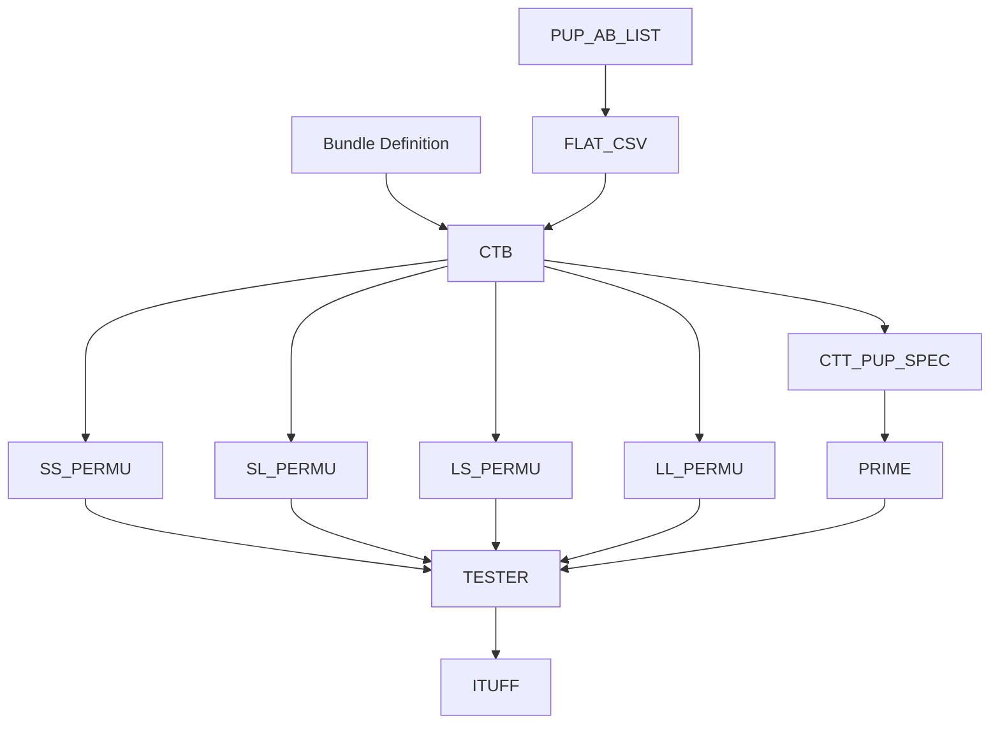
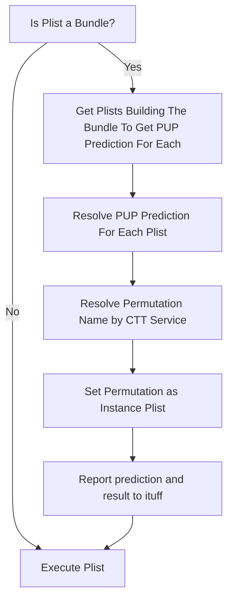
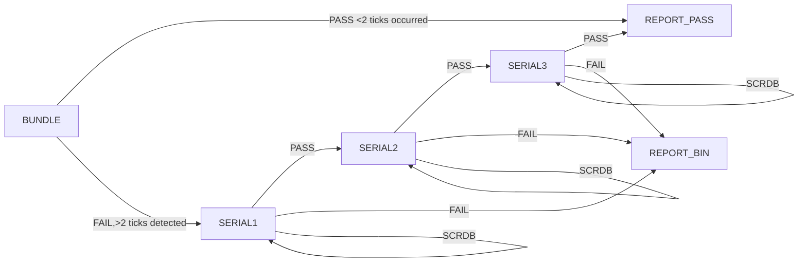
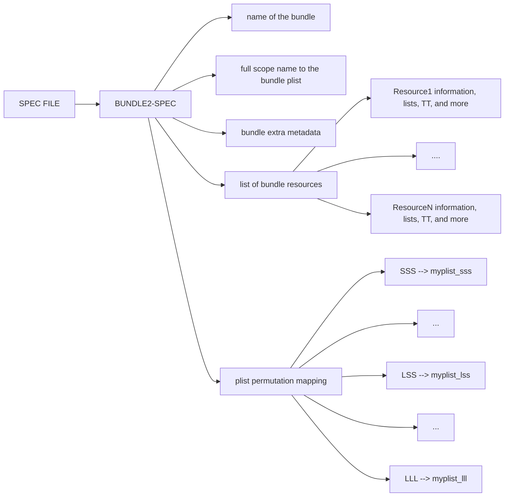

# CTT & PUP Harmony Mode

## Introduction 
As Intel advances its IDM 2.0 strategy, test cost emerges as a pivotal metric for the success of product production and profitability.
Currently, a variety of methods are used to reduce test costs. In this specification, we will delineate a contract between two innovative solutions:
Concurrent Test Technology (CTT) and Per Unit Plist (PUP).

Concurrent Test Technology (CTT) is designed to optimize testing efficiency by segmenting test content into smaller, manageable units known as atomic patterns.
It uses a sophisticated scheduling algorithms that aim to maximize resource utilization by running multiple tests concurrently, thereby significantly reducing test time.

Per Unit Plist (PUP),a dynamic machine learning-based solution. It builds short & long version of each plist, then per unit, it predicts the relevant version (Short/Long) 
based on analysis of million of units and DPM calculations. This approach tailors the testing process to each unit's specific characteristics & enhancing overall testing 
efficiency.

## Flow
we will start by a high level flow describing the tools, inputs & outputs of the system 


### Explanation
* after 1M units, Advanced Analytics team is expected to release a file contains list of test-ids to keep for SHORT prediction
* automation by test-time owners consuming the file and creating a CSV defines test-id &  prediction for all plists targeted by PUP
* CTT uses the CSV file as an input, creating all possible permutations of a bundle, each permutation contains the content that left and based on the prediction
* in addition a new file called ctt_pup.spec is created documenting the bundle structure, TestTime per plist and the possible permutations
* the plists & pup-spec will be loaded to the TP and handled at init time, creating a data-structure & store it by PRIME for execution time
* for each unit, a new feature is added to VminSearch setting the relevant PLIST based on PUP prediction
* flow chart describing the algorithm done by PRIME VminSearch, CTTService & PUPService



# SCOREBOARDING IN BUNDLES
SCORE-BOARD feature can be very expensive when applied on bundles, since it requires a re-test at a lower voltage and in-some cases the re-test can happens few times as well.
an example:
bundle of 2 floors, where the base floor is 1s and the 2nd floor 400ms, after optimization the bundle test-time is 1s.
in case of SCRDB required to the 2nd floor (400ms), the whole bundle need to be executed (1s) which will be much longer than what is required (300ms)

therefore, a different architecture is required to accomplish no high overhead on SCRDB-mode but still supply the required data.
the new CTT bundles architecture called "Midterm solution" where CTT is executed at the end of the CHK flow and each bundle-composite consist 
the bundles and the serial ingrediants as well, in-case of bundle failures, the serial ingrediants are executed for recovery.
to support SCRDB on top of this flow, a new feature is developed called "Terminator", the terminator terminates the bundle execution if it exceeds 
2 ticks without storing/changing the VMIN of the associated corners. the bundle failures will cause the unit to execute the fail-flow with SCRDB mode enabled 
and result-in same legacy behaviour known and used.



to complete the picture and be able to evaluate the ROI of targeting any PLIST used in CTT by PUP, a spec file with all relevant information is auto-generated 
among other CTT files per bundle and copied to the patterns Release area under Mctt module.

before describing the spec parts, let's clear and define the possible predications and the relevant marking.
### Prediction Key
<table>
<tr><td>Prediction</td><td>Long-Name/Short-Name</td><td>description</td></tr>
<tr><td>None</td><td>LONG/L</td><td>full list will be used</td></tr>
<tr><td>Monitor</td><td>LONG/L</td><td>used as prediction health check, full list will be used</td></tr>
<tr><td>Short</td><td>SHORT/S</td><td>set a reduced list of patterns selected by PUP</td></tr>
</table>


## Spec File High Level Structure


### BundleName
BundleName, associated plist and hosting instance share the same naming structure.

MCTT _ [TAG] _ [BUNDLEALIAS] _ [CTFFREQ]

example: mctt_0p0_b17_400

## Example of a Spec File

```JSON
{
  "name": "mctt_b0_0p0_b3",
  "bundlePlistName": "IP_CPU::mctt_lll_11_0p0_b3_200_plist",
  "metadata": {
    "ccr_tt": "237624491"
  },
  "structure": [
    {
      "resourceName": "vccgt",
      "plistName": "IP_CPU::arrsa_gt_chk_f4_ks_tito_fullring_port1_list",
      "metadata": {
        "misc": {
          "serial_tt": "211757808"
        }
      },
      "items": [
        {
          "plistName": "arrsa_gt_chk_f4_ks_tito_fullring_port1_list",
          "plistFile": "/nfs/iil/disks/mpe_hvmpats_005/hdmxpats/lnl/MGarr/RevTLB0.0/p9/plb/ARR_GT_allplist.plist",
          "serialTTInMs": "2117"
        }
      ]
    },
    {
      "resourceName": "vccl2",
      "plistName": "IP_CPU::atom_ssa_chkatomf01_f01_ks_tito_x_ds_lfm_ctt_epbist_list",
      "metadata": {
        "misc": {
          "serial_tt": "190772332"
        }
      },
      "items": [
        {
          "plistName": "atom_ssa_chkatomf01_f01_ks_tito_x_ds_lfm_ctt_epbist_list",
          "plistFile": "/nfs/iil/disks/mpe_hvmpats_005/hdmxpats/lnl/MAarr/RevTLB0.0/p8/plb/maarr_epbist_atom_ks_class_lfm_ctt_lnl_allplist.plist",
          "serialTTInMs": "1907"
        }
      ]
    },
    {
      "resourceName": "vccsa",
      "plistName": "IP_CPU::sa_dim_chksa_f02_allatspeed_ssn200_x_x_x_edt_x_meclk_list",
      "metadata": {
        "misc": {
          "serial_tt": "228050100"
        }
      },
      "items": [
        {
          "plistName": "sa_dim_chksa_f02_allatspeed_ssn200_x_x_x_edt_x_meclk_list",
          "plistFile": "/nfs/iil/disks/mpe_hvmpats_005/hdmxpats/lnl/MscnDIM/RevTLB0.0/p16/plb/sascan.class.hvm.dim_allplist.plist",
          "serialTTInMs": "2280"
        }
      ]
    }
  ],
  "permutations": [
    { "key": "SSS", "permuPlistName": "IP_CPU::mctt_sss_11_0p0_b3_200_plist" },
    { "key": "SSL", "permuPlistName": "IP_CPU::mctt_lsl_11_0p0_b3_200_plist" },
    { "key": "SLS", "permuPlistName": "IP_CPU::mctt_lls_11_0p0_b3_200_plist" },
    { "key": "SLL", "permuPlistName": "IP_CPU::mctt_lll_11_0p0_b3_200_plist" },
    { "key": "LSS", "permuPlistName": "IP_CPU::mctt_lsl_11_0p0_b3_200_plist" },
    { "key": "LSL", "permuPlistName": "IP_CPU::mctt_lsl_11_0p0_b3_200_plist" },
    { "key": "LLS", "permuPlistName": "IP_CPU::mctt_lls_11_0p0_b3_200_plist" },
    { "key": "LLL", "permuPlistName": "IP_CPU::mctt_lll_11_0p0_b3_200_plist" }
  ]
}

```

# Working in Harmony Mode DryRun
TBD

# Opens
1. due to binning granularity, bundles with more than a single ingredient targeting same IP & POWER-Domain,
are not grouped in a single instance when SCRDB is performed, therefore, SCRDB result is logged per ingredient,
what is the impact? is only a single ingredient can be targeted? 
