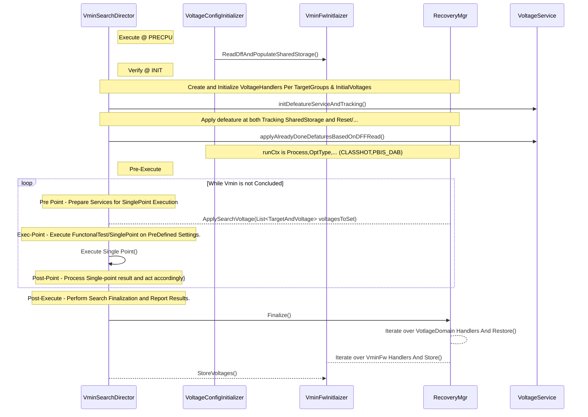

# Recovery

there are 2 config files by PRIME
1. Defaetature tracking: a json that define the group of ips to perform recovery
define family and number of instances

rule what is healthy recovery
1. minimum count of IPs
2. valid combinations

setPoint patmod infra to apply recovery settings (setpoints & patmod)

need to add RecoverySpec(Modulke, Group=Disabiling_slice, RulesGroup=VPU1_RUlE] at the Corenr Mapping file
need to define a mapping between a failling IP to the recovery String

