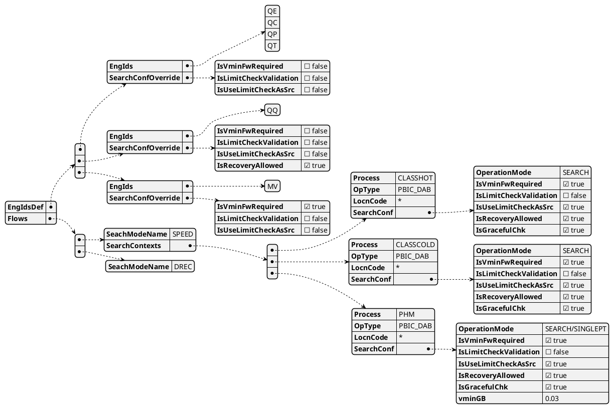

# Search Init Spec
|            | Comments                                                                          |
|------------|-----------------------------------------------------------------------------------|
| Definition | a configuration file of test-modes and a definition of the search mode per socket |
| Scope      | Global per product                                                                |
| Owner      | DIG_BASE Module Owner                                                             |

