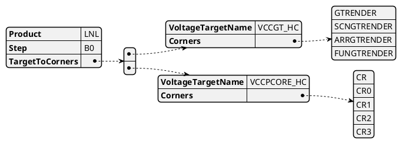

# TP Spec

|            | Comments                                                        |
|------------|-----------------------------------------------------------------|
| Definition | a mapping between Corner to voltage target required for autogen |
| Scope      | per Module/SubModule                                            |
| Owner      | Module Owner                                                    |

1. need to support DPS & DLVR (For the same domainsCore)

