# Generation Spec

|            | Comments                                                           |
|------------|--------------------------------------------------------------------|
| Definition | a crafting spec describing and mapping plists to frequency corner. |
| Scope      | per Module/SubModule                                               |
| Owner      | Module Owner                                                       |

```plantuml

@startjson
[
    {
        "ModuleName": "SAQ",
        "Description": "this is the crafting spec for LNL SAQ Module",
        "TestingSpec": {
            "Timing": "saq_rom_chk_F1_mbist_list",
            "Levels": "IP_CPU_BASE::SBF_nom_lvl",
            "Features": {
                "DecodingType": "LOG1_DECODER"
            },
            "FreqTestingSpec": [
                {
                    "FreqName": "F1",
                    "SetupFlowItems": [
                        "IP_CPU::FLOW1_PRE"
                    ],
                    "FinalizeFlowItems": [
                        "IP_CPU::FLOW1_FINALIZE"
                    ],
                    "FeaturesOverride": {
                        "DecodingType": "LOG1_DECODER_AHMAD"
                    },
                    "PlistsSpec": [
                        {
                            "Name": "saq_lsa_chk_F1_mbist_list"
                        },
                        {
                            "Name": "saq_ssa_chk_F1_mbist_list",
                            "TimingOverride": "saq_rom_chk_F1_mbist_list",
                            "LevelsOverride": "IP_CPU_BASE::SBF_nom_lvl"
                        },
                        {
                            "Name": "saq_rom_chk_F1_mbist_list",
                            "FeaturesOverride": {
                                "DecodingType": "TRIVIAL_PASSFAIL"
                            }
                        },
                        {
                            "Name": "saq_ssa_chk_F1_mbist_sbclk_list"
                        },
                        {
                            "Name": "saq_lsa_chk_F1_mbist_sbclk_list"
                        },
                        {
                            "Name": "saq_xsa_chk_F1_mbist_ddr_list"
                        },
                        {
                            "Name": "san_lmax_ks_ddr_list"
                        }
                    ]
                },
                {
                    "Freq": "F2",
                    "SetupFlowItems": [
                        "IP_CPU::FLOW2_PRE"
                    ],
                    "FinalizeFlowItems": [
                        "IP_CPU::FLOW2_FINALIZE"
                    ],
                    "PlistsSpec": [
                        {
                            "Name": "saq_lsa_chk_F2_mbist_list"
                        },
                        {
                            "Name": "saq_ssa_chk_F2_mbist_list"
                        }
                    ]
                }
            ]
        }
    },
    {
        "ModuleName": "SAN",
        "Description": "this is the crafting spec for LNL SAQ Module",
        "TestingSpec": {
            "Timing": "saq_rom_chk_F1_mbist_list",
            "Levels": "IP_CPU_BASE::SBF_nom_lvl",
            "Features": {
                "DecodingType": "LOG1_DECODER"
            },
            "FreqTestingSpec": [
                {
                    "FreqName": "F1",
                    "FeaturesOverride": {
                        "DecodingType": "LOG1_DECODER_AHMAD"
                    },
                    "PlistsSpec": [
                        {
                            "Name": "san_lsa_chk_F1_mbist_list"
                        },
                        {
                            "Name": "san_lmax_ks_ddr_list"
                        }
                    ]
                },
                {
                    "Freq": "F2",
                    "SetupFlowItems": [
                        "IP_CPU::FLOW2_PRE"
                    ],
                    "FinalizeFlowItems": [
                        "IP_CPU::FLOW2_FINALIZE"
                    ],
                    "PlistsSpec": [
                        {
                            "Name": "san_lsa_chk_F2_mbist_list"
                        },
                        {
                            "Name": "san_ssa_chk_F2_mbist_list"
                        }
                    ]
                }
            ]
        }
    }
]
@endjson
```

