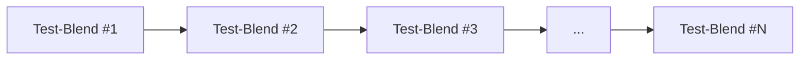
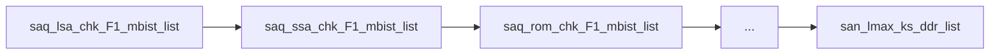
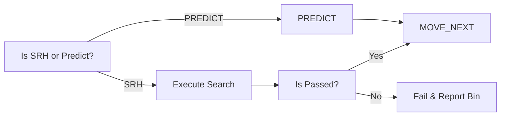
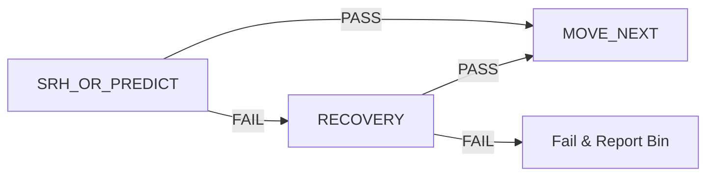
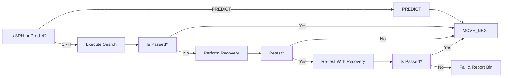
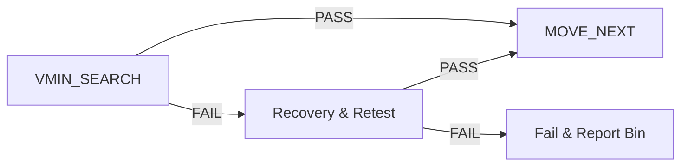

# Converged VminSearch Spec

# Problem Statment
1. Complex VminSearch Template and includes a lot of built-in features
2. dozens of input parameters
3. Diverged CTT VminSearch and Redo
4. No Code Sharing between proucts in same Org or outside of Org
5. No Unit tests and Coverage
6. Manual crafting and cannot run in a standalone mode

# Motivation & Targets
1. Dependency Free Test Instances
2. Search template Simplification & Native CTT Support
3. Increase abstraction and TP autogen ("TBD") friendly
4. Consolidation of Search & Check

# High Level Arch
a change in arch is required to build a scalable & generic VminSearch, the changes will include both auto-generated parts as well as manual&custom parts
the Arch in High Level representing a Test-instance.

# TP Flow Architecture

Example:

**Test-Blend Def** : a group of composites/test-instances grouped in a single composite achivieving a full isolated/standalone testing for
a specific IP/FREQ.

**Test-Blend internal Structure:**

### USER-Defined PRE, MID & POST
a place-holders where users/MOs can introduce custom test-instances required to perform the actual IP/Freq testing
or for debug and analysis purposes.
examples:
1. applying a PAT-MOD instance for defeaturing
2. Corner Update
3. etc..

### Search Composite
a place holder to perform the search or the prediction - a cheaper test bringing the Vmin to a working zone to decrease full check test to tick
there are few possible combinations:

| Option | Search | Predict |  Recovery  | ReTest |
|--------|:------:|:-------:|:----------:|:------:|
| #1     |   X    |         |            |        |
| #2     |        |    X    |            |        |
| #3     |   X    |         |     X      |        |
| #4     |   X    |         |     X      |   X    |

#### Predict/VminSearch with No Recovery
based on the Skew definition and the data per IP/Freq, autogen will place the relevant test-template (Search/Predict), incase of a pass the flow will progress to the next composite,
incase of a failure testing will stop and the associated Bin will be reported.

#### Predict/VminSearch With Recovery and Retest
for low-yield products, the recovery is a must-have feature, therefore, a recovery flow must be well-defined and places incase of Search failures

in High Level

in more Low Level diagram including Retest:

### Check Composite
the check is the main component and will include 3 test-instances
1. VminSearch instance: locate the Lower Vmin for a set of conditions (PLIST, Voltage & Freq)
2. Recovery Instance: handles Recovery incase of failures and set a remede to continue the part testing.
3. Scoreboard Instance: handles data-logging to ituff providing insights about the limiting patterns

in High Level

### Possible combinations

| Option | VminSearch | Recovery | ScoreBoard | ReTest |
|--------|:----------:|:--------:|:----------:|:------:|
| #1     |     X      |          |            |        |
| #2     |     X      |          |     X      |        |
| #3     |     X      |    X     |            |        |
| #4     |     X      |    X     |            |   X    |
| #5     |     X      |    X     |     X      |        |
| #6     |     X      |    X     |     X      |   X    |

# VminSearch template

## Features:

| Feature                       | SupportedToday? | Recommendation | Description                                                                                           |
|-------------------------------|-----------------|----------------|-------------------------------------------------------------------------------------------------------|
| Multipass                     | Y               | Fork           | repeat same testing on different set of IPs with relevant masking                                     |
| Scoreboarding                 | Y               | Fork           | execute plist at specific voltage and collect failing patterns ids                                    |
| VBUMP                         | N               | Required       | set the power-domain at high voltage to workaround reset failures                                     |
| Termination                   | N               | Required       | terminate test-execution incase of #ticks > #threshold                                                |
| Recovery                      | N               | Required       | based on testing results, perform recovery on selected domains                                        |
| Prediction & OverShoot        | Y               | Drop           | start testing at predicted Vmin, incase of first-pass rerun vmin-search starting from overshoot value |
| Vmin Forwarding               | Y               | Required       | store & forward the vmin located at current testing conditions                                        |
| Various Voltage Types Support | N               | Required       | handle different voltage targets types, such as DPS, DLVR or both at the samew test-instance          |
| Vmin Export to SharedMemory   | N               | Drop           | save the vmin-result to the shared memory with some GB                                                |
| CTT                           | N               | Required       | multi-domain parallel search and special start pattern & ticking handling                             |
| Search Point Expression       | N               | Required       | set testing VMIN to a new value and report fwed value incase of pass                                  |
| Various pass/fail indications | N               | Required       | read/analyze execution results and report pass/fail and ticking required list                         |
| integrated PATMods for Freq   | N               | Required       | handling feature enabiling/disabiling inside the test instance for dependency free testingt           |
| ITuff & Trace Logging         | N               | Required       | export & log vmin-search results to ituff for TRACE & other tools reports                             |
| Sku Special handling          | N               | Required       | different handling of vmin-search based on active sku per unit                                        |
| Cold/CSM Support              | N               | Required       | support cold & csm sockets where forwarding is not allowed and more constraints are available as well |
| Vmin Export & Intrpolation    | N               | Fork           | handle Vmin-Results export for UPS include interpolation                                              |

