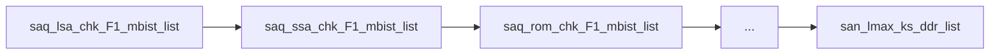
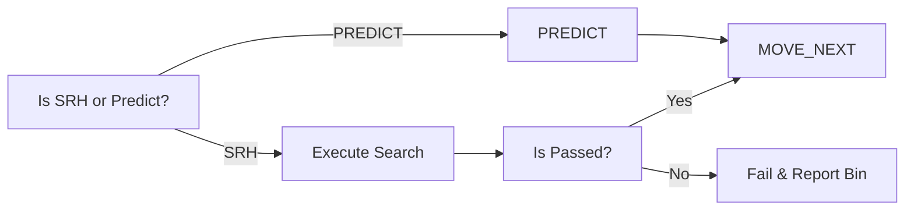
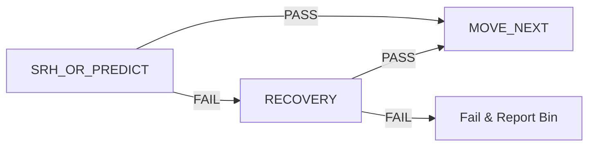
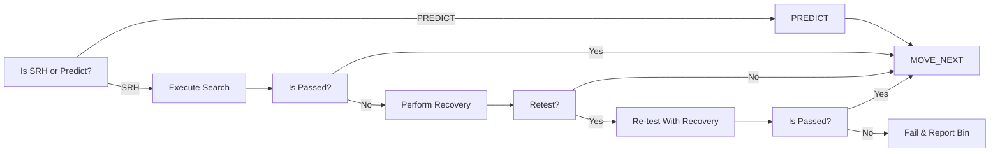
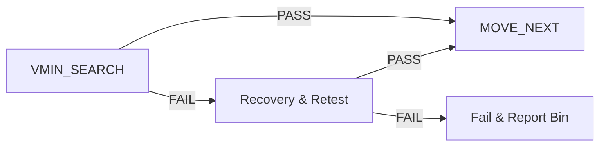

# Converged VminSearch Spec

# Problem Statment
1. Complex VminSearch Template and includes a lot of built-in features
2. dozens of input parameters
3. Diverged CTT VminSearch and Redo
4. No Code Sharing between proucts in same Org or outside of Org
5. No Unit tests and Coverage
6. Manual crafting and cannot run in a standalone mode

# Motivation & Targets
1. Dependency Free Test Instances
2. Search template Simplification & Native CTT Support
3. Increase abstraction and TP autogen ("TBD") friendly
4. Consolidation of Search & Check

# High Level Arch
a change in arch is required to build a scalable & generic VminSearch, the changes will include both auto-generated parts as well as manual&custom parts
the Arch in High Level representing a Test-instance.

# TP Flow Architecture

Example:

**Test-Blend Def** : a group of composites/test-instances grouped in a single composite achivieving a full isolated/standalone testing for
a specific IP/FREQ.

**Test-Blend internal Structure:**

### USER-Defined PRE, MID & POST
a place-holders where users/MOs can introduce custom test-instances required to perform the actual IP/Freq testing
or for debug and analysis purposes.
examples:
1. applying a PAT-MOD instance for defeaturing
2. Corner Update
3. etc..

### Search Composite
a place holder to perform the search or the prediction - a cheaper test bringing the Vmin to a working zone to decrease full check test to tick
there are few possible combinations:

| Option | Search | Predict |  Recovery  | ReTest |
|--------|:------:|:-------:|:----------:|:------:|
| #1     |   X    |         |            |        |
| #2     |        |    X    |            |        |
| #3     |   X    |         |     X      |        |
| #4     |   X    |         |     X      |   X    |

#### Predict/VminSearch with No Recovery
based on the Skew definition and the data per IP/Freq, autogen will place the relevant test-template (Search/Predict), incase of a pass the flow will progress to the next composite,
incase of a failure testing will stop and the associated Bin will be reported.

#### Predict/VminSearch With Recovery and Retest
for low-yield products, the recovery is a must-have feature, therefore, a recovery flow must be well-defined and places incase of Search failures

in High Level

in more Low Level diagram including Retest:

### Check Composite
the check is the main component and will include 3 test-instances
1. VminSearch instance: locate the Lower Vmin for a set of conditions (PLIST, Voltage & Freq)
2. Recovery Instance: handles Recovery incase of failures and set a remede to continue the part testing.
3. Scoreboard Instance: handles data-logging to ituff providing insights about the limiting patterns

in High Level

### Possible combinations

| Option | VminSearch | Recovery | ScoreBoard | ReTest |
|--------|:----------:|:--------:|:----------:|:------:|
| #1     |     X      |          |            |        |
| #2     |     X      |          |     X      |        |
| #3     |     X      |    X     |            |        |
| #4     |     X      |    X     |            |   X    |
| #5     |     X      |    X     |     X      |        |
| #6     |     X      |    X     |     X      |   X    |

# VminSearch template

So What? what we get by the test-blend atrch
1. standalone & dependecy free
2. same PRE for both SRH & CHK
3. maintence and sustain --> what ever goes to chk/srh goes for both
4. the combination of search & check into a single test-blend will enable the check if a specefic freq already executed and give the ability to skip it and avoid redundent re-testing
5. Ctt ready, to run a test-blend without any knowledge or PATMOD handling

Ideas:
1. add a tag parameter for each test-instance to ease the bypass/unpass procedure
2. 

## Features:
### Multipass
The input parameter is list of bitArray (each bit represents a core) --> the order of cores defined in VoltageVminForwading
**Recommendation:** for CTT Based TP --> we will flatten the Multipass to enable bundle per pass.

### Scoreboard
scoreboard will be extracted from the regular vminSearch to simplify the regular VminSearch
what is required to run Scoreboard:
1. the SCRDB Voltage --> VminSearch Volrage - X Ticks
2. BaseNmber & MaxFail, Mode

gap: abstraction and move the configuration to a central place + baes-number allocation
Open:
* to execute the SCTDB standalone or as part of VminSearch

### VBUMP
2 params are required: Trigger Map & Levels
--> sync with plist must be ensured (trigger patterns exists)
--> voltage targets have 2 types DLVR/DPS, part of these targets supports only one while other support both, at first si as example, we can use DPS but afterwards to use DLVR
--> YBS will instruct where VBUMP is required per domain & corer
--> need a hancler per "list of targets"
--> testmethod wlll have lsit of handlers 
--> need to have 2 type of methods to support PerTick as well as initialvoltage
--> we will develop a checker as part of the pull request to validate VBUMP params & plist in sync
--> each test-instance will be able to control VBUMP en/dis per group/voltage target --> by default auto-gen will set it by YBS guidlines

### Prediction & OverShoot
today AA team provides a file that contains TOKEN & FORMULA
at PRECPU, a code reads the file and save the VMIN PER targeted instances in shared memory.
TODAY: each "targeted" testinstance need to add 2 fields (Predicut=SHARED_STORAGE_PARAM_NAME & OverShot=OTHER_SHARED_STORAGE_PARAM_NAMN)
at GetStartVoltage --> set PREDICTED voltage and execute --> incase of pass --> set OVERSHOOT value and restore.

**gap**: remove the usage of params in-test-instanace and do it by code automatically, get instance name and check shared storage... incase of feature enabled set the precited and overshoot parameters... 

### Vmin Forwarding
when vmin fw is required? 
* By default Start&End Voltage defined at test-instance will be rendered ConvertVoltageToDoubles

Search --> get FW and use it if avaialbe 
SearchnoFw --> will start from Low-->High as defiend in test instnce 
SearchAndKill --> use FW value, find Vmin --> incase VminSearch Value is greater than LimitCheck (Global Def at VminForwarding) --< mainly used at COLD & CSM sockets
SinglePoint --> used at PHM where checking PList at LIMIT_CHECK Point

LimitCheck values are defined at PRECPU by DIG_BASE and it's based on CLASSHOT/COLD and it's per unit nad basd on DFF
HOT --> CSM/COLD --> PHM HOT --> PHM COLD
Search --> SearchAndKill --> SinglePoint

LNLVMinSearchINIT sets the testing modes for the VminSearch, is it recovert? LimitCheck? ... it's a dynamic and will be controled by product
need to:
1. extract the information to a config file

### Vmin Export to SharedMemory
to limit the dependecy to the test-blen internals --> the Shared Memory feature will be supported but with 
a context --> the store and the restore will be forced to be inthe same TEST-BLEND!!!

### ITuff & Trace Logging
* need tp review the code and suggest a new way to perform the ituff writing
* open: what is really required? why CTT is different? and how to support that

### per sku handling
1. step size
2. start voltage
3. corner skip
4. scrdbb ticks TH
5. freq switch adjustment --> ???

### Frequency settings
by default the sttings will be extracted from the domain and flow nad using VminFw service and need to make usre that there is an option to set it
this will simplify
setPreInstance & setPostInstance --> need to clear the methodology here that each test-instnce clean,

frequency dependecy exist nad different between different test-types, therfore, we can define a dependency rule & formula per 
tag and apply it automatically, still, users can set any freq they want for debug

### Vmin Export & Intrpolation
need to enforce that SEARches will use a different corner for observability and export capablite

#### Enhancement
PRIME: use a more abstract way for cores names and not by bit position

| Feature                       | SupportedToday? | Recommendation | Description                                                                                           |
|-------------------------------|-----------------|----------------|-------------------------------------------------------------------------------------------------------|
| Multipass                     | Y               | Required       | repeat same testing on different set of IPs with relevant masking                                     |
| Scoreboarding                 | Y               | Fork           | execute plist at specific voltage and collect failing patterns ids                                    |
| VBUMP                         | N               | Required       | set the power-domain at high voltage to workaround reset failures                                     |
| Prediction & OverShoot        | Y               | Drop           | start testing at predicted Vmin, incase of first-pass rerun vmin-search starting from overshoot value |
| Vmin Forwarding               | Y               | Required       | store & forward the vmin located at current testing conditions                                        |
| Various Voltage Types Support | N               | Required       | handle different voltage targets types, such as DPS, DLVR or both at the samew test-instance          |
| Vmin Export to SharedMemory   | N               | Required       | save the vmin-result to the shared memory with some GB                                                |
| Search Point Expression       | N               | Required       | set testing VMIN to a new value and report fwed value incase of pass                                  |
| Various pass/fail indications | N               | Required       | read/analyze execution results and report pass/fail and ticking required list                         |
| integrated PATMods for Freq   | N               | Required       | handling feature enabiling/disabiling inside the test instance for dependency free testingt           |
| ITuff & Trace Logging         | N               | Required       | export & log vmin-search results to ituff for TRACE & other tools reports                             |
| Sku Special handling          | N               | Required       | different handling of vmin-search based on active sku per unit                                        |
| Cold/CSM Support              | N               | Required       | support cold & csm sockets where forwarding is not allowed and more constraints are available as well |
| Vmin Export & Intrpolation    | N               | Fork           | handle Vmin-Results export for UPS include interpolation                                              |
| Recovery                      | N               | Required       | based on testing results, perform recovery on selected domains                                        |
| CTT                           | N               | Required       | multi-domain parallel search and special start pattern & ticking handling                             |
| Termination                   | N               | Required       | terminate test-execution incase of #ticks > #threshold                                                |

## System interesting strenths
1. the ability to order the test-blends based on si data and for free with risk free.

Open:
* subroutine refresh checkers
* patmod on 2 domains 
* how to skip flows/composites per mode
* will create a frequency settings and dependency at module level (KISS)
* restore DLVR feature
* TP Creatures Naming Convention Engine
* On-Boarding & Configuration files manager
* How Freedy implemented DTS ? Ahmad to check
* Apply Mask is TestMethod -->> CVminSearch: ApplyMask()
* Change REcovery to Yield Recovery
* 

# YBD
1. supply VBUMP info
2. supply prediction Test2Spec
3. supply start voltage & end volrage 
4. PerSkew 

# Checkers
1. VBUMP Checker to validate the VBUMP is well defined (ALEX)
2. PATMOD SetPoints conventions checker --> to validate all setpoints follow the future agreed convention -- AR Kochav
3. 