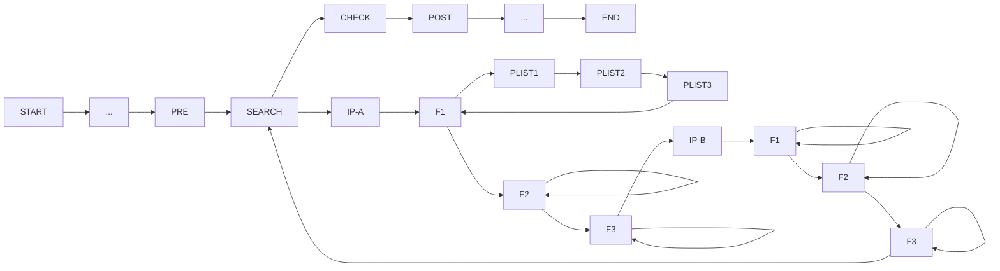
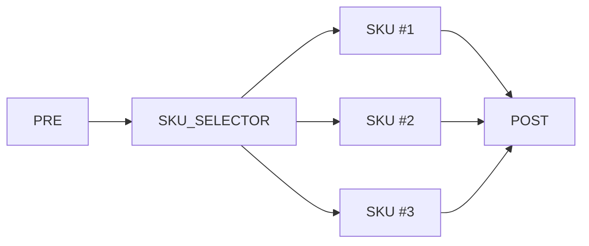
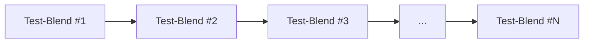
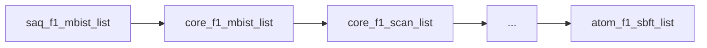
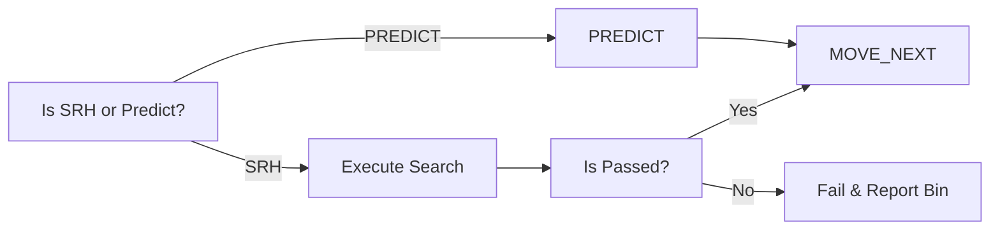
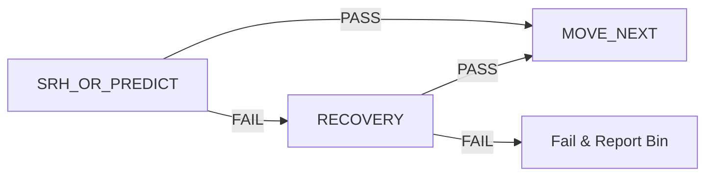
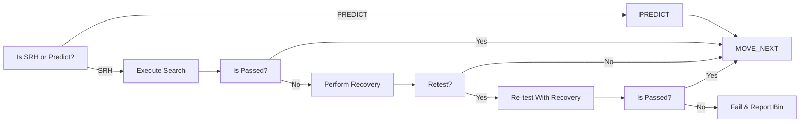
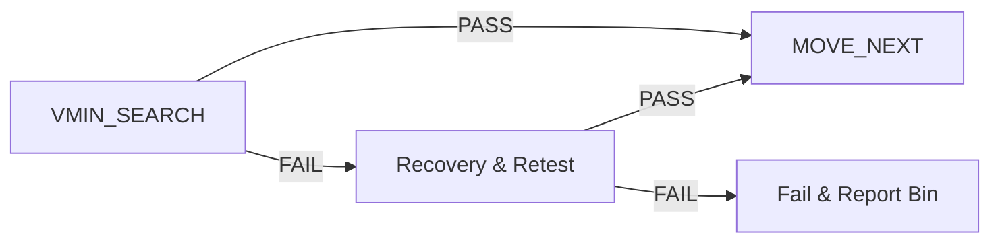

# Introduction and Architecture

# Ultimate Goals
1. TestProgram Simplicity, efficent and Dependency free design
2. Converged, Scalable and generic VminSearch template with CTT native support
3. PDE Productivity enhancements, up-level tp abstraction, automations and assistive technologies

# Problem Statment
1. Complex VminSearch Template and includes a lot of built-in features
2. dozens of input parameters
3. Diverged CTT VminSearch and Redo
4. No Code Sharing between proucts in same Org or outside of Org
5. No Unit tests and Coverage
6. Manual modules crafting and maintenance process

# High Level Arch
the Dependency term means that each test-instance should include all required settings and the acutal test-templates to perform the testing, 
in order to fullfill this request and based on existing building blocks in current testing echo-system, we are proposing building a test-composite/test-blend that 
will include test-instances of search to bring the Vmin to a working point before the check is being executed, as well as, will be place holders for user-defined instances 
that is required for a valid testing or any further actions later in the test-program stream.

we will use the term "**test-blend**": a group of test-instances required to perform testing of an ip or more at a specefic frequency.

# Current TP Architicture
* test program built from a predefined flow of test-composites
* each composite include other test-composites for a specific IP
* each IP test-composite include other test-composities per frequency corner
* each Frequency corner include test-instances performing actual testing as well as control instances to set a PATMOD, update corner and other instrumental actions.

below you can find an illustration on the hierarches and the structure of the current TP Flow:

# Future TP Flow Architecture
we are proposing 3 major changes to the test-program architecture
1. consolidate the SEARCH and CHECK test-composites
2. Flatten BinMatrix and design the system in SKU based design
3. use Test-Blends instead of test-instance as test leaves

## Test Program Flow

**"CLASSIFY"** is a test composite that will include a new flows of test-composites as follows:

* SKU Selector - is an entity that we will develop to select the relevant SKU based on the units params and DFF data from previous sockets
* each SKU will include list of IPs & test-blends or bundles incase of CTT.

### SKU Design illustration
each SKU will consist test-blends based on YBS SKU spec definition. 

Example:

Now we would like to define what is a "test-blend" and what it includes.
will start from a definition:

**Test-Blend Def** : a group of composites/test-instances grouped in a single composite achieving a full isolated/standalone testing for
a specific IP/FREQ.

**Test-Blend internal Structure:**

above is a super-set of a test-blend, based on TP flows and requirements several options are available and will be mostly common

| Option | PRE | SRH | MID | CHK | POST |                                      DESC                                       |
|--------|:---:|:---:|:---:|:---:|:----:|:-------------------------------------------------------------------------------:|
| #1     |     |  X  |     |  X  |      | no special handling required, search, check and set the Vmin of associated test |
| #2     |  X  |  X  |     |  X  |      |         a special PATMOD/preparations is required to perform SRH & CHK          |
| #3     |     |     |     |  X  |      |         Check is only required and no special preparations is required,         |
| #4     |  X  |     |     |  X  |      |         No Search is required but some custom preparations is required          |
| #5     |  X  |     |     |  X  |  X   |          No Search, custom preparations and post actions are required           |
| #6     |  X  |  X  |     |  X  |  X   |                custom preparations and post actions are required                |
| #7     |  X  |  X  |     |     |      |             search only corner and custom preparations is required              |
| #8     |  X  |  X  |     |     |  X   |           search only corner, both pre and post actions are required            |

* Mid is a placeholder to export search results or any custom action required between SRH & CHK - no use-case for now.

### USER-Defined PRE, MID & POST
a place-holders where users/MOs can introduce custom test-instances required to perform the actual IP/Freq testing
or for debug and analysis purposes.
examples:
1. applying a PAT-MOD instance for defeaturing
2. Corner Update
3. etc..

### Search Composite
a place holder to perform the search or the prediction - a cheaper test bringing the Vmin to a working zone to decrease full check test to tick
there are few possible combinations:

| Option | Search | Predict |  Recovery  | ReTest |
|--------|:------:|:-------:|:----------:|:------:|
| #1     |   X    |         |            |        |
| #2     |        |    X    |            |        |
| #3     |   X    |         |     X      |        |
| #4     |   X    |         |     X      |   X    |

#### Predict/VminSearch with No Recovery
based on the SKU definition and the data per IP/Freq, autogen will place the relevant test-template (Search/Predict), incase of a pass the flow will progress to the next composite,
incase of a failure testing will stop and the associated Bin will be reported.

#### Predict/VminSearch With Recovery and Retest
for low-yield products, the recovery is a must-have feature, therefore, a recovery flow must be well-defined and places incase of Search failures

in High Level

in more Low Level diagram including Retest:

### Check Composite
the check is the main component and will include 3 test-instances
1. VminSearch instance: locate the Lower Vmin for a set of conditions (PLIST, Voltage & Freq)
2. Recovery Instance: handles Recovery incase of failures and set a remede to continue the part testing.
3. Scoreboard Instance: handles data-logging to ituff providing insights about the limiting patterns

in High Level

### Possible combinations

| Option | VminSearch | Recovery | ScoreBoard | ReTest |
|--------|:----------:|:--------:|:----------:|:------:|
| #1     |     X      |          |            |        |
| #2     |     X      |          |     X      |        |
| #3     |     X      |    X     |            |        |
| #4     |     X      |    X     |            |   X    |
| #5     |     X      |    X     |     X      |        |
| #6     |     X      |    X     |     X      |   X    |

# PROS of current design
1. standalone & dependency free testing
2. same PRE for both SRH & CHK
3. maintenance and sustain --> what ever goes to chk/srh goes for both
4. the combination of search & check into a single test-blend will prevent testing same corner and waste testtime
5. Ctt ready, to run a test-blend without any knowledge or PATMOD handling 