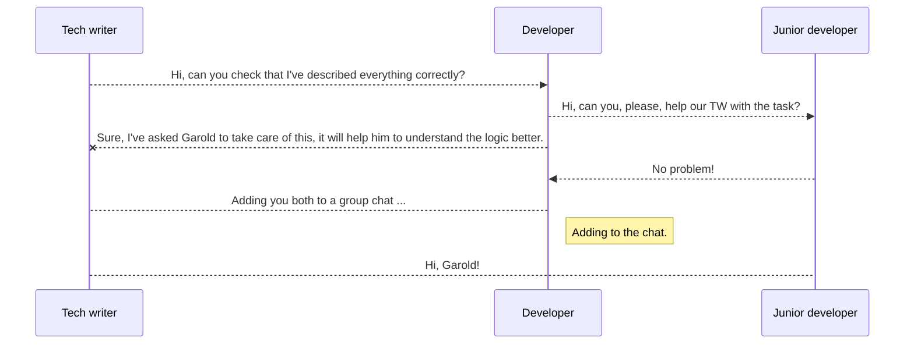
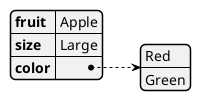
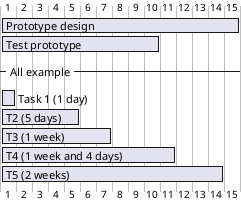
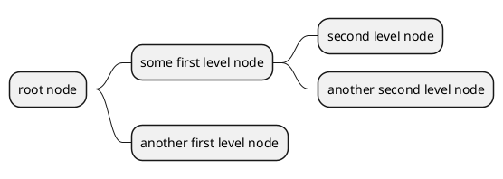
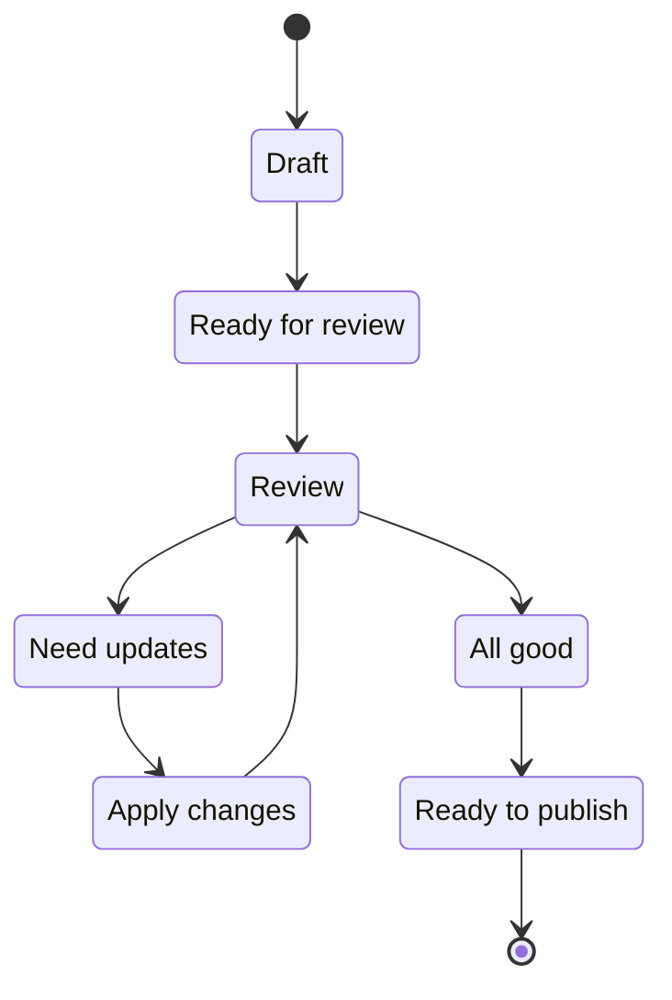
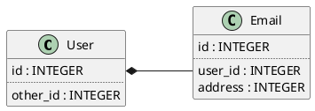

# Examples

```mermaid
sequenceDiagram
    Tech writer -->> Developer: Hi, can you check that I've described everything correctly?
    Developer -->> Junior developer: Hi, can you, please, help our TW with the task?
    Developer --x Tech writer: Sure, I've asked Garold to take care of this, it will help him to understand the logic better.
    Junior developer -->> Developer: No problem!

    Developer --> Tech writer: Adding you both to a group chat  ...
    Note right of Developer: Adding to the chat.

    Tech writer --> Junior developer: Hi, Garold!
```

```plantuml
@startjson
 {...}
@startjson
{
"fruit":"Apple",
"size":"Large",
"color": ["Red", "Green"]
}
@endjson
```

```plantuml
@startgantt
 {...}
@startgantt
[Prototype design] requires 15 days
[Test prototype] requires 10 days
-- All example --
[Task 1 (1 day)] requires 1 day
[T2 (5 days)] requires 5 days
[T3 (1 week)] requires 1 week
[T4 (1 week and 4 days)] requires 1 week and 4 days
[T5 (2 weeks)] requires 2 weeks
@endgantt
```

```plantuml
@startmindmap
 {...}
@startmindmap
* root node
    * some first level node
        * second level node
        * another second level node
    * another first level node
@endmindmap
```

```mermaid
stateDiagram-v2
    [*] --> Draft
    RR: Ready for review
    NU: Need updates
    AC: Apply changes
    LGTM: All good
    RP: Ready to publish
    Draft --> RR
    RR --> Review
    Review --> NU
    NU --> AC
    AC --> Review
    Review --> LGTM
    LGTM --> RP
    RP --> [*]
```

```plantuml
 {...}
@startuml
left to right direction

class User {
id : INTEGER
..
other_id : INTEGER
}

class Email {
id : INTEGER
..
user_id : INTEGER
address : INTEGER
}

User::id *-- Email::user_id
@enduml
``` 